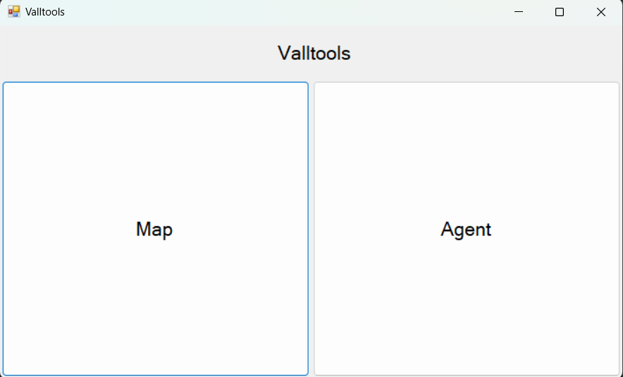
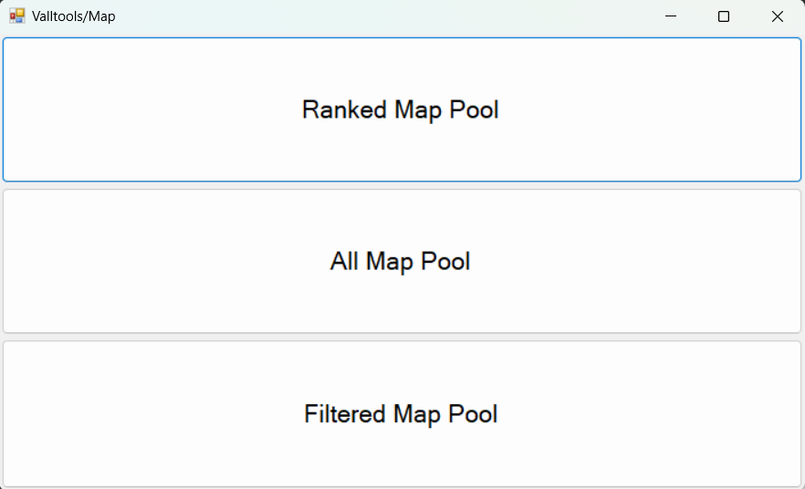
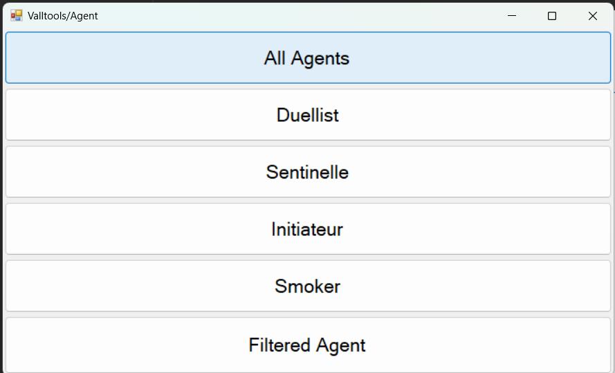
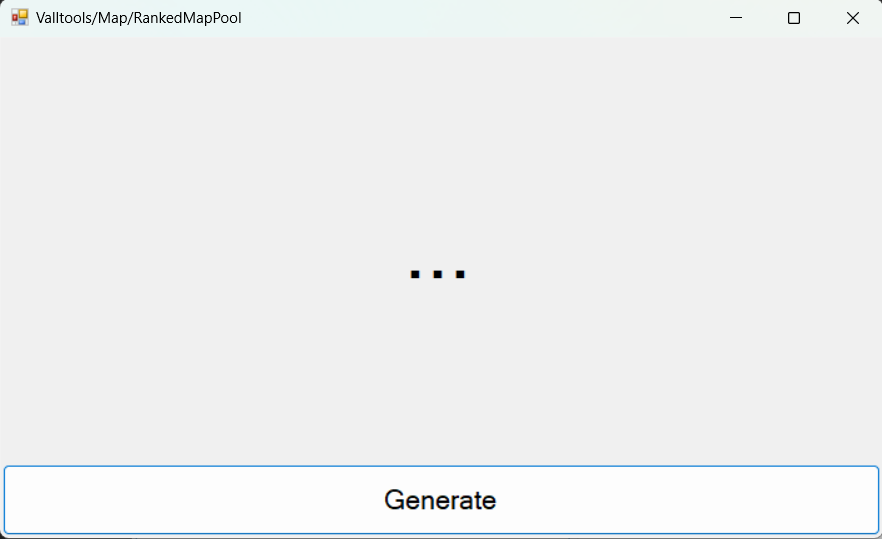
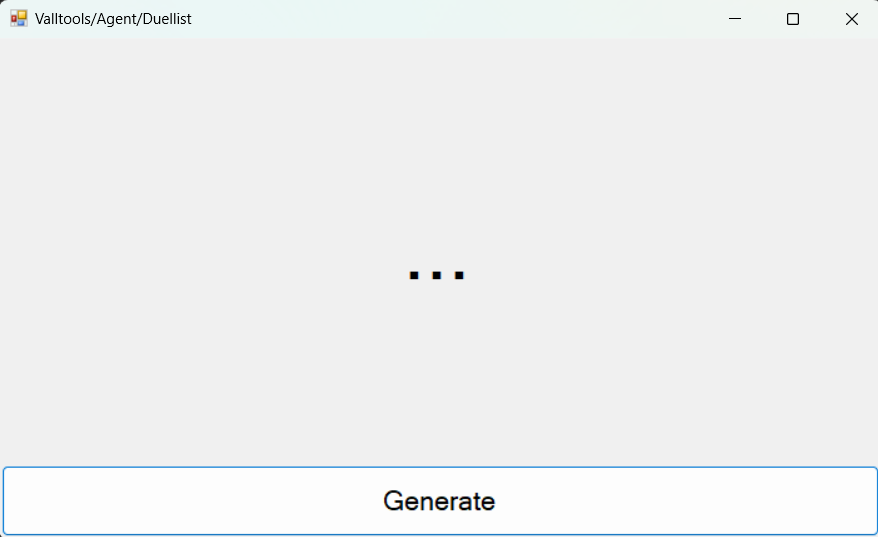

# Valltools

## Présentation
Tabatage est une application pour ordinateur qui permet de générer des agents et des maps de valorant aléatoirement. Cette application a été réalisé en Windows forms c#.

## Interface
Le jeux est composé de quatre écrans :
- un écran d'accueil
  
- un écran pour choisir le map pool
  
- un écran pour choisir l'agent pool
  
- un écran pour générer les maps et agents
  
  

## Fonctionnalités
- Choisir si l'on veut générer un map ou un agent
- Choisir les maps possibles
- Choisir les agents possibles
- générer une map
- générer un agent
